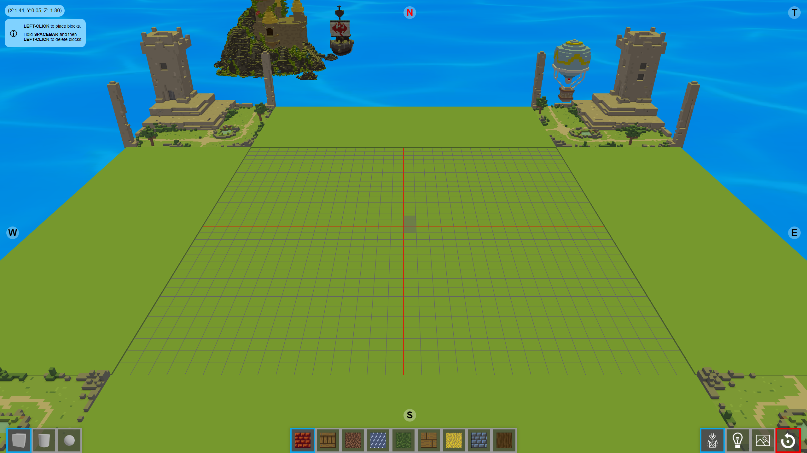

# Block Building

This is a simple block building simulator using Three.js.



## Features

-   Place blocks in a 3D environment
-   Choose between different forms
-   Select different textures
-   Get creative
-   View your creation with a scenig camera shot

---

### Start Playing Right Away

Access the app with this link: [Block Building](https://dt1337.github.io/block-building)
or go to the `Deployments` section on the right and open the latest github-pages deployment.

---

## Getting Started

### Prerequisites

Make sure you have Node.js and npm installed on your machine.

### Installation

1. Clone this repository:

```bash
git clone https://github.com/dt1337/block-building.git
```

2. Navigate into the project directory:

```bash
cd block-building
```

3. Install dependencies:

```bash
npm install
```

### Development

To start the development server, run:

```bash
npm start
```

This will start the development server at `http://localhost:5173/block-building/`.
